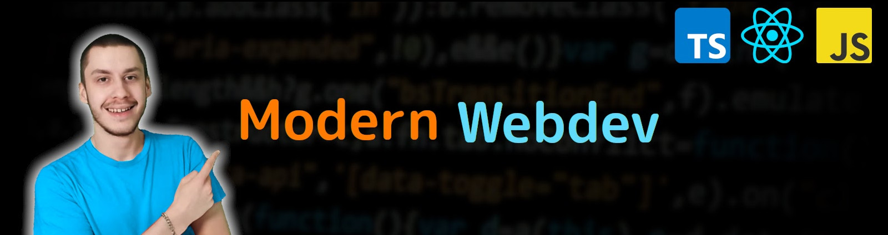

<div align="center">
  
  <span>
    I believe programming is one of the
    <i> most valueable </i>
    skills to improve the way you think about problems
  </span>
  <p class="spacer"></p>
</div>

Which is why I share my coding knowledge and opinions on my [WebDev-YouTube-Channel](https://youtube.com/NiklasZiermann) to share my passion for this awesome skill.

- 🔐 TypeScript aficionado (**pro** ReturnTypes)
- 📈 Bullish on React Server Components
- 🥞 Full Stack with a Frontend Preference
- ❤️ Loving JS tooling (caused me stop using Python)
- 🎥 [WebDev YouTuber](https://youtube.com/NiklasZiermann)
- 🎓 Passionate teacher
- 🐶 Dog Dad (Belgian Malinois)

---

<h3>Youtube Content</h3>
<table>
<!-- YOUTUBE-VIDEOS-LIST:START --><tr><td><a href="https://www.youtube.com/watch?v=sLPT_2YqmWc"></a></td><td><a href="https://www.youtube.com/watch?v=sLPT_2YqmWc">State is NOT Async But...</a></td></tr>
<tr><td><a href="https://www.youtube.com/watch?v=qjEFlKFufaw"></a></td><td><a href="https://www.youtube.com/watch?v=qjEFlKFufaw">Creating Games in React!?</a></td></tr>
<tr><td><a href="https://www.youtube.com/watch?v=5vZQjL9edJA"></a></td><td><a href="https://www.youtube.com/watch?v=5vZQjL9edJA">Get a React Job in 2024</a></td></tr>
<!-- YOUTUBE-VIDEOS-LIST:END -->
<tr><td><a href="https://youtu.be/fZPgBnL2x-Q?si=Gpa62PYYu15SqKvT"></a></td><td><a href="https://youtu.be/fZPgBnL2x-Q?si=Gpa62PYYu15SqKvT">My FreeCodeCamp Zustand Course</a></td></tr>
</table>

```typescript
thanks.forEach(() => 'like' && 'comment');
```

<p>✉️ <b><i><a href="https://n-ziermann.com/contact">Get in touch</a></i></b> ✉️</p>
